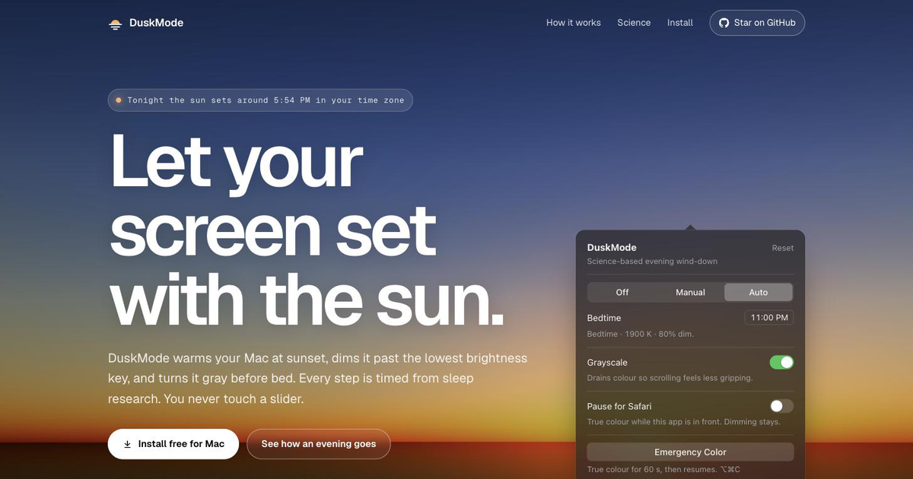

# DuskMode

**Let your Mac set with the sun.** DuskMode is a free, open-source menu bar app that warms your screen at sunset, dims it past the lowest brightness key, and turns it gray before bed. Every step is timed from sleep research, and you never touch a slider.

**Website:** https://neerajsingh869.github.io/DuskMode/



## Install

Paste this into Terminal:

```bash
curl -fsSL https://raw.githubusercontent.com/neerajsingh869/DuskMode/main/install.sh | bash
```

It downloads the latest release, moves `DuskMode.app` to `/Applications` and opens it. [Read the script](install.sh) before you run it. It's about 40 lines.

**Why Terminal?** DuskMode isn't signed with a paid Apple Developer ID yet. macOS blocks unsigned apps downloaded in a browser. Files downloaded with `curl` aren't quarantined, so there is no block.

**Prefer a normal download?**
1. Download `DuskMode.dmg` from [the latest release](https://github.com/neerajsingh869/DuskMode/releases/latest) and drag the app to Applications.
2. Open it. macOS says it can't check the developer. Click **Done**.
3. Open **System Settings → Privacy & Security** and click **Open Anyway**. You only do this once.

**Requirements:** macOS 13 Ventura or later, Apple Silicon.
**Uninstall:** quit DuskMode (right-click the menu bar icon → Quit) and move it to the Bin.

## What it does

DuskMode runs one continuous evening timeline, counted back from your bedtime and started at your local sunset. There are three layers, each arriving when it starts to matter:

| Layer | When | What it does | Evidence |
|---|---|---|---|
| **Warmth** | From sunset | 6500 K down to 1900 K. Cuts blue near 464 nm, where melatonin suppression peaks, and trims green near 555 nm. | Strong |
| **Dimming** | From sunset, deepest at bedtime | Up to 80% darker than your lowest brightness key. Light level moves melatonin more than light colour does. | Strong |
| **Grayscale** | From 1.5 h before bed | Drains colour from feeds and thumbnails so one more video is easier to skip. | Emerging |

Tonight's anchors (with an 11:00 PM bedtime): Warm 8:30 PM · Dusk 9:00 PM · Grayscale 9:30 PM · Red 10:00 PM · Bedtime 11:00 PM. Values slide continuously between anchors, so there are no visible steps.

### The details

- **Auto, Manual or Off.** Auto runs the timeline. Manual gives you warmth and dimming sliders. Off leaves the screen alone.
- **Colour-critical apps pause it on their own.** Figma, Sketch, Photoshop, Lightroom, Illustrator, Affinity, Pixelmator, Capture One, Final Cut, DaVinci Resolve and Blender are added to the pause list automatically if they're installed. While one is in front, colour and grayscale go back to normal. Dimming stays, so switching apps never flashes bright. Add any other app with the **Pause for [app]** switch, and remove any app with ✕.
- **Emergency Color: ⌥⌘C.** Full colour for 60 seconds, then the evening eases back in.
- **Invisible on calls and screenshots.** Warmth and dimming are applied at the display, after anything captures the screen. Zoom, Meet and screenshots get normal colours. This was tested with Apple's ScreenCaptureKit: a white pixel reads 255, 255, 255 with the filter on.
- **Your real sunset.** Worked out on your Mac with NOAA's solar equations from a one-time location fix. If location is denied, it's estimated from your time zone.
- **Private.** No account, no analytics, no update checks. DuskMode never opens a network connection. You can check with `lsof -i -a -p $(pgrep -x DuskMode)`, which prints nothing.
- **Starts at login.** It registers itself once on first launch. Turn it off in System Settings → General → Login Items.
- **0.0% CPU at idle.** It's one 30-second timer, and macOS is allowed to coalesce it.

### Honest limitations

- **Grayscale wins over warmth.** macOS applies its grayscale filter after DuskMode's warmth, so from the grayscale step onward the screen is plain gray. Only dimming keeps reducing the light from then on.
- **Grayscale shows a macOS confirmation.** Turning grayscale on or off shows the system's "Colour Filters" notice for about a second. It can't be suppressed.
- **Grayscale uses a private macOS function** (`UAGrayscaleSetEnabled`, Apple's own Colour Filters switch). It is isolated in one file with two public fallbacks. Everything else uses public APIs.

## The science

Every setting traces back to a paper. [`research/citations.json`](research/citations.json) lists the 17 studies across 7 topics, and [`research/notes.md`](research/notes.md) turns them into numbers. The settings window's Science tab shows them too, including the counter-evidence: a 2023 Cochrane review found blue-blocking glasses show no clear sleep benefit. DuskMode's answer is to reduce the whole dose and time it, rather than filter weakly at any hour.

## How it works

| Piece | File | Technique |
|---|---|---|
| Colour + dimming | `Sources/DuskMode/Engines/GammaEngine.swift` | `CGSetDisplayTransferByFormula` on every display, the same public method f.lux uses. Blacks stay black, and macOS restores the gamma when the app quits. |
| Fallback | `Engines/OverlayEngine.swift` | A click-through overlay window, used only if the gamma call is unavailable. |
| Grayscale | `Engines/GrayscaleEngine.swift` | Accessibility Colour Filters, with a preference write and a keyboard shortcut as fallbacks. |
| Timeline | `Sources/DuskModeCore/CircadianTimeline.swift` | Piecewise-linear anchors counted back from bedtime. |
| Sunset | `DuskModeCore/SolarCalculator.swift` | Self-written NOAA solar equations. |
| Kelvin → RGB | `DuskModeCore/ColorTemperature.swift` | Blackbody approximation, normalised to 6500 K. |
| Colour-critical apps | `DuskModeCore/ColorCriticalApps.swift` | A bundle ID list, each app added to the pause list once. |

Native Swift and AppKit, with no third-party code. [`CLAUDE.md`](CLAUDE.md) records every design decision and the reasons behind it. [`REGRESSIONS.md`](REGRESSIONS.md) lists every bug fixed so far and the invariant that keeps each one fixed.

## Build from source

You need the Xcode Command Line Tools (Swift 6). Full Xcode isn't required.

```bash
git clone https://github.com/neerajsingh869/DuskMode.git
cd DuskMode
swift run DuskModeSelfTest      # 50 checks on the timeline, solar and colour maths
./build.sh release run          # builds DuskMode.app and launches it
```

The website lives in [`site/`](site/). It's plain HTML, CSS and JavaScript, deployed to GitHub Pages by [`.github/workflows/pages.yml`](.github/workflows/pages.yml).

## Licence

[MIT](LICENSE) © 2026 Neeraj Singh. Made for my own evenings, then shared.
